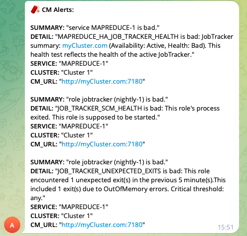

# cm-alert-telegram
Cloudera Manager alert script to Telegram Group

# Screenshoot


# Installation
## 1. Download Script
```
# cd /opt/cloudera/cm/
# git clone https://github.com/kholis/cm-alert-telegram
# mv cm-alert-telegram alert
```

## 2. Edit config match your environment
```
# Please edit this
BOT_TOKEN="XXXXXXXX"
CHAT_ID="1234567890"
CM_PORT=7180 # Secure: 7183, NonSecure: 7180
#export https_proxy=http://proxy.corporate.com:8080
```

## 3. Deploy script with owner `cloudera-scm`
```
# chown -R cloudera-scm:cloudera-scm /opt/cloudera/cm/alert
```

## 4. Add script to `alert.script.path` in CM
1. Goto `CM > Cloudera Management Service > Configuration` then search: `alert.script.path`
2. Fill with `/opt/cloudera/cm/alert/cm2tele.sh`
3. Save changes.
4. Restart "Alert Publisher" instances.

# Testing Script
`$ bash -x cm2tele.sh alert.json`

# Environment
Tested in Cloudera CM 7.x.x (CDP7)
